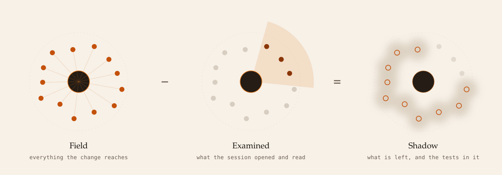

<picture>
  <source media="(prefers-color-scheme: dark)" srcset="../docs/img/hero-night.svg">
  
</picture>

*Every image in this document is generated by [`../docs/gen_svgs.py`](../docs/gen_svgs.py), which reproduces the artwork exactly, while the committed files additionally carry C2PA content credentials, so re-running the generator shows a metadata-only difference.*

# Umbra

*Archived 2026-09-09. This was the submission document for a one-day event.*

*What left it and where it went. The four graph findings with their
verification are now phase 29 of [NOTES.md](../NOTES.md). The Noon Curveball
section is phase 30 there, rewritten as design notes for the evidence tiers
rather than as a response to a constraint. The rule about which commits carry a
checkpoint trailer, and the two sessions that shared one worktree, are phase 31.
No claim was changed in the move.*

*What was dropped rather than moved, because each answered a rubric and nothing
else: the track number and the section arguing the track, the "One sentence"
heading the outline required, and the table of which checkpoint proves what to a
judge. The limitations and next steps below are unchanged and stay here.*

*Every commit hash in this document belongs to the fork,
`u7k4rs6/entire-graph`, where it was written. They are not this repository's.*


Umbra finds the code an AI agent's change affects but the agent never looked
at, by subtracting the session's attention from the change's blast radius.

<picture>
  <source media="(prefers-color-scheme: dark)" srcset="../docs/img/subtraction-night.svg">
  
</picture>

## Problem and intended user

The reviewer of an agent-authored change, who has to decide where to look
first.

A clean diff and a confident commit message tell that reviewer what changed.
They do not tell the reviewer what the agent never opened. The everyday case is
a signature change with seven callers, three of them tests in a file the
session never touched, committed with a message saying the callers were checked
because one test file happened to run and pass.

Umbra answers a question no existing tool answers: of everything this change
can reach, what did the session never look at, and which tests reach that
shadow.

## Architecture and main workflow

One static binary, `entire-umbra`, dispatched by the Entire CLI kubectl style
as `entire umbra <checkpoint>`. There is no model anywhere in it; the core is
deterministic and offline.

```
entire umbra <ref> --test "pytest -v" --out ./out
```

Seven steps:

1. **Resolve.** Turn a checkpoint id or commit-ish into a checkpoint, a commit
   and its parent, and record how the pairing was made.
2. **Check out.** Detached worktrees of head and parent under the plugin data
   directory, never the user's working tree.
3. **Load the field.** `graph snapshot` for symbols and relations,
   `graph capabilities` for which relations this build emits, and
   `graph commit` for the changed symbols and their change kinds.
4. **Walk it.** Breadth first to the requested depth, keeping each dependent's
   shortest path back to a source.
5. **Subtract.** Build the examined set from the checkpoint's tool activity and
   the agent's own words, then classify every node as lit, penumbra, umbra or
   unknown.
6. **Probe.** Select the tests that reach shadow, record a baseline on the
   parent with `graph verify`, and adjudicate the same command on head, so a
   test that was already red is not reported as a new failure.
7. **Sweep.** Run the whole suite once. Any test that changed state but was
   never selected is a leak, and carries the reason selection missed it.

Output is a terminal table, a JSON report, a one page packet for a pull request
comment, and a self contained HTML eclipse map that replays the session's
attention in order. Exit code 2 on a `--fail-on` condition, for CI.

### The four states

| State | Meaning |
|---|---|
| lit | read with a range covering the symbol, at or after the change began, or edited |
| penumbra | half seen, in five tiers: glance, glimpse, quoted, afterimage, echo |
| umbra | nothing in the session touched the file or named it |
| unknown | the transcript carries no tool events and no mentions |

Missing data is a state, never an error.

## Setup, run and test

Requires the Entire CLI with Checkpoints enabled, the `entire-graph` plugin, a
Go toolchain with CGO, and Python for the fixture.

```
# the plugin
go install github.com/entireio/entire-graph/cmd/entire-graph@main
entire plugin install "$(go env GOBIN)/entire-graph" --force
entire graph version

# umbra
cd umbra
go build -o "$HOME/.local/bin/entire-umbra" ./cmd/entire-umbra
go test ./... -timeout 40m

# the fixture, then a run
cd fixtures/app && ./setup.sh && cd ../..
. umbra/fixtures/app/.venv/bin/activate
entire umbra 6dea614c --test "pytest -v" --out ./out
open ./out/umbra.html
```

Use `pytest -v`, never `pytest -q`. Quiet mode prints no per-test ids, so
`graph verify` cannot name which test broke and the verdict degrades to a
suite-level pass or fail.

The runner has to be on `PATH`, which is why the virtualenv is activated: the
tests run in a detached worktree that has no virtualenv in it.

## Known limitations and next steps

### The external review, and what was done about it

An external review of this project raised ten issues. Two were fixed in code
and the rest are recorded here rather than patched, because a rushed fix to
test selection an hour before submission is worse than a documented gap.

**A caveat on this list first.** The brief I worked from enumerated eight of
the ten specifically enough to act on. The remaining two were not described to
me, so they are not listed below. I have not invented two findings to reach a
round number. If the reviewer's full list is to hand, those two belong here.

**Fixed in code.**

1. **The sweep reported a false zero.** When verification came back degraded
   and produced no comparable test ids, the leak count printed as `0`, which is
   indistinguishable from a sweep that compared every test and found nothing.
   The report made its strongest claim out of its weakest evidence. Now the
   sweep reports "audit inconclusive" with the reason in all four surfaces and
   never a count; a real clean sweep still reports 0 leaks.

2. **A failed read marked a node lit.** The transcript parser records a Read
   when the tool call is made, before the result arrives, and never consulted
   `tool_result.is_error`. A read of a path that does not exist counted as
   inspection, so Umbra reported code as examined that the session never saw.
   Failed reads are now dropped.

**Why those two.** They are the only two on the list where Umbra reports
something false about the code under review. Everything else is a gap between
the documents and the binary, which misleads a reader of the design; these two
mislead a reader of the output, which is the thing the tool exists to produce.
Both also fail in the direction that flatters the tool: a false zero looks like
a clean audit, and a false lit looks like diligence. Both changes can only move
the report toward saying less, never more.

**Documented, not fixed.**

3. **`.umbra.json` does not exist.** `docs/SECURITY_AND_ACCESS.md` describes a
   committed file supplying the runner prefix. It was never implemented; the
   runner comes only from `--test`.

4. **`umbra clean` does not exist.** Described as removing all worktrees.
   There is no such subcommand. Worktrees are deleted by hand.

5. **`umbra record --scrub` does not exist.** There is no `--scrub` flag.
   Scrubbing is not optional and always runs, which is stricter than the
   document describes rather than weaker.

6. **Graph call timeouts are not what the document says.** No 60 second
   per-call timeout and no 30 second snapshot warning exist. The real timeouts
   are the 10 minute verify invocation and the 20 minute sweep.

7. **Go test selection does not work.** Test ids are built in pytest's
   `file::name` form and appended to the runner as plain arguments. `go test`
   reads a non-flag argument as a package pattern, not a filter, so the id
   selects nothing. This is the one that would have been tempting to fix
   quickly and is exactly the wrong thing to attempt under time pressure:
   getting it right means translating an id into `-run '^Name$'` plus a package
   path, and getting it wrong means the probe step silently runs the wrong
   tests, which is a worse failure than not running them.

8. **`--adapter`.** The review says it is accepted but ignored. **The review is
   wrong on this point**, and it was checked rather than assumed:

   ```
   $ entire umbra HEAD --adapter codex --run none
   umbra: --adapter must be auto or claude-code, not "codex"
   ```

   An unsupported value is rejected with a clear message already. The accurate
   and smaller residue is documented instead: both accepted values resolve to
   the same adapter and the report's adapter field is set directly in
   `analyze.go`, so the flag is validated and then not otherwise used.

**Five of these passed `go test` and `go vet` while asserting nothing about the
behaviour they name.** Findings 3 through 7 are all of that shape: the code
compiles, the suite is green, vet is silent, and not one test claims that
`.umbra.json` is read, that `clean` exists, that a Graph call times out, or
that a Go test id selects a test. Nothing was broken by these, because nothing
ever exercised them.

That is the same class of problem as the `Box.Overlaps` case already recorded
in `umbra/NOTES.md`: four label-placement tests across eight scenarios all
rested on one overlap function, and making it return false for every pair left
every one of them passing. A green suite is evidence that the assertions hold,
and it is not evidence that the assertions are about anything. Both fixes in
this pass therefore ship with a known-positive that was proved to fail when the
fix is reverted, which is the standard the project already set for itself.

**One thing this pass could not settle.** The `cmd/entire-umbra` package failed
once during this work and passed on both immediate reruns. The failing run took
86 seconds against 20 seconds for the passes, which points at the worktree path
rather than at either fix, and is consistent with the stale worktree limitation
already recorded below. It is written down rather than dismissed as a flake,
and it is not claimed to be understood.

**What that turned out to be, checked afterwards.** The stale worktree does not
only fail a run. It makes the five end to end tests in `cmd/entire-umbra` call
`t.Skip`, because they treat a checkout the toolchain cannot analyse as a
skip rather than a failure. That is why the package kept reporting `ok` in 20
seconds: it was not passing those tests, it was declining to run them. After
`git worktree prune` the same five execute, and each takes about 230 seconds
because each builds a full graph snapshot over 763 files.

The consequence is that `go test ./...` with Go's default 600 second per
package timeout fails on a clean machine, on time rather than on any assertion,
and every earlier green run of that package in this document was green partly
because those five were skipping. Measured with the timeout raised, the package
passes in 1397 seconds:

```
ok  github.com/u7k4rs6/entire-graph/umbra/cmd/entire-umbra  1397.603s
```

The reproduce block above now says `go test ./... -timeout 40m`. This is a
sixth instance of the same class as findings 3 through 7: green, and about
nothing, until someone looked at why it was fast.


- **The examined set is built from tool activity.** An agent that reads and
  edits through shell commands rather than file tools leaves no read or edit
  event, so its work looks unexamined. Umbra found this pointed at itself: run
  on the commit where it changed its own `shadow.Build`, all twelve dependents
  came back umbra, correctly, because that change was made with a shell
  command. It is disclosed rather than tuned away, and every report carries a
  coverage line saying how many events were file reads and how many were shell
  commands, so a thin report can be told from a real finding.

- **Stale worktrees.** Worktrees are keyed by commit under a shared data
  directory, so two checkouts of one repository collide on one worktree. A
  leftover from a deleted checkout is removed and pruned first, but one
  belonging to a different live checkout is still reused and carries that
  checkout's `.git` link, which can fail a run that did nothing wrong. Delete
  by hand:

  ```
  rm -rf "$ENTIRE_PLUGIN_DATA_DIR/wt"                  # managed install
  rm -rf "${XDG_CACHE_HOME:-$HOME/.cache}/umbra/wt"    # otherwise
  ```

  Under a managed install that first path is usually
  `~/.local/share/entire/plugins/data/umbra/wt`.

- **`umbra clean` is documented and was never built.** It appears in
  `umbra/docs/SECURITY_AND_ACCESS.md` as the way to remove worktrees. It does
  not exist. The manual deletion above is the real answer.

- **A check is only trusted once it has been observed failing.** Four
  verifications in this project returned confident passes that were wrong:
  local tests green on a repository a clone could not build; a cracked-probe
  count that named a test outside the selection; a commit check that counted
  `ok` lines instead of looking for `FAIL`; and a refs audit that reported
  thirty refs of zero bytes because `git ls-tree` is scoped to the working
  directory. The worst had no symptom at all: four label-placement tests across
  eight scenarios were all built on one overlap function, and making it return
  false for every pair left every one of them passing. Every check named here
  now has a test that plants what the check is for and was proved to fire by
  mutating the code it checks. That is the standard, not a guarantee that
  nothing else passes for the wrong reason.

- **Graph edges are not complete.** Reflection, dynamic dispatch and
  configuration are invisible, so umbra is a lower bound on what was
  unexamined. The sweep's leak reasons are how the size of that gap is seen.

- **Ranking weights are hand set and printed.** They are a heuristic, not a
  measurement, and every factor is shown next to the node so the score can be
  recomputed by hand.

### Next steps

Adapters for agents other than Claude Code, which currently receive the
`unknown` state, correctly. A `clean` subcommand, since one is already
documented. Coverage deltas, which need coverage tooling in the target
repository.
